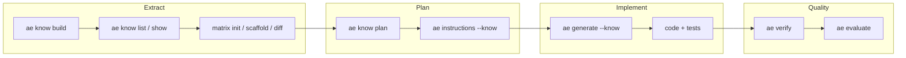

# From know extraction to implementation

This document ties together **how to extract domain knowledge**, **how to turn it into work**, and **what to simplify or strengthen next** so agents and humans can repeat the loop reliably—especially on **large codebases** (many small packs, not one giant blob).

See also: [`ae_know_design.md`](ae_know_design.md) (pipeline architecture), [`ae_e2e_log.md`](ae_e2e_log.md) (what was exercised in this repo), [`ae_e2e_just_migration.md`](ae_e2e_just_migration.md) (Just + `ae know plan --out`), root [`justfile`](../justfile).

## End-to-end pipeline



**Practical order for a feature:**

1. **Extract** sources into **named packs** (`ae_docs_*`, `ae_pkg_*`, …).
2. **Optional:** `matrix.yaml` in hub + **repo** `docs/feature_matrix.yaml` for status tracking (see [Repo vs hub matrix](#repo-vs-hub-matrix)).
3. **Plan:** `ae know plan --name <primary_pack>` → single markdown bundle (index + matrix + normative pointer).
4. **Bootstrap docs:** `ae instructions --context library --action bootstrap --know <pack>`.
5. **Scaffold AE files:** `ae generate --library-id … --library-root … --engine template --know <pack>` (add `--dry-run` first).
6. **Prove:** `ae verify` / `ae evaluate` on structured inputs (contracts in [`error_code_playbook.md`](error_code_playbook.md)).

**Hub resolution:** from a shell in the repo root, the CLI discovers **`.ae_hub/`** by walking **upward from cwd** (then `~/.ae_hub/`). Use `--hub <path>` when cwd is not inside the project.

## What works well today (keep)

| Practice | Why |
|----------|-----|
| **Shard by concern** — multiple `know build` names | Bounds token size per `know show`; clearer ownership. |
| **Stable pack IDs** — prefix + role (`ae_docs_error_codes`) | Scriptable `--know`, predictable automation. |
| **`--path` for local files** | No fake `file://` quirks; explicit and fast. |
| **`matrix scaffold` → `docs/feature_matrix.yaml`** | Repo-level “where we are” without stuffing the hub. |
| **`ae know matrix diff`** (hub vs repo file) | Structural compare when `matrix.yaml` is canonical. |
| **`FileHubResolver` cwd walk** | `instructions` / `generate --know` work from repo root without extra flags. |

## What to simplify or remove (reduce friction)

| Area | Current pain | Direction |
|------|----------------|-----------|
| **Multiple CLI invocations** | One `know build` per file in scripts | **Single manifest** (YAML list of path → pack name) consumed by a thin script or future `ae know build --manifest`. |
| **Single `--know`** | Large tasks need several packs; users rerun commands | **`--know` bundle** (ordered list), or **`defaults.know_packs`** in `hub.yaml`. |
| **Plan export** | Shell + `python3` to peel `plan_markdown` | **First-class** `ae know plan --out file.md` (or JSON field only in stdout). |
| **Noise in git** | Hub + scaffold files | **Already gitignored** for `.ae_hub/`, generated matrix, Rust `spec/` exports; use `just e2e-reset` between experiments. |

## What to add or make “more complex” (on purpose)

These add structure up front so **implementation and review** get easier—not harder.

| Addition | Payoff |
|----------|--------|
| **Normative pointer** in pack metadata (`meta.yaml` / plan section) | Separates “what the standard says” from “what we implemented.” |
| **Feature IDs** in `matrix.yaml` (stable slugs) | Deterministic diffs and CI gates (`matrix diff` / future `proof` column). |
| **Proof column** (tests, fixtures, links) | Honest **partial** / **yes** states; reduces hand-wavy rows. |
| **TOC pack** — one tiny pack listing other pack names + one-line roles | Navigation without duplicating full text. |
| **MCP: one call, N packs** | Fewer round trips for IDE agents (product shape TBD). |

## Repo vs hub matrix

- **Hub template** (`ae know matrix init` on a pack): canonical **column schema** + **feature IDs**; good for copying into new projects.
- **Repo artifact** (`ae know matrix scaffold`): **implementation status** for *this* repository; should stay in git next to code if the team tracks coverage there.

**Rule of thumb:** treat **`matrix.yaml` as source of truth** for machine diff; treat **markdown matrix** as a human view (generate or validate from YAML).

## Running the local experiment (this repository)

```bash
just e2e
# Optional: network smoke pack + full downstream smoke
AE_E2E_NETWORK=1 AE_E2E_EXTENDED=1 just e2e
```

- **`AE_E2E_EXTENDED=1`** runs: `instructions --know`, `generate --know`, `verify`, `evaluate`, `package resolve/validate`, `doctor`.
- Plan export uses **`ae know plan --out`** (no Python).

After a successful run:

```bash
cd experiments/ae_rust_contract && cargo test && cargo run -p ae_cli_stub -- parity-check
```

## Honest limits (still true)

- **Token ceiling:** any single pack that grows too large defeats the purpose of sharding; split by package or concern.
- **One `--know` per command:** orchestrate multiple packs with a shell loop, a manifest, or (future) bundle support.
- **Registry / network:** URL and registry flows depend on connectivity; local `--path` / `file://` flows do not.

## Summary

**Extract** with small, named packs and optional **matrix** artifacts. **Plan** with `ae know plan` and **instructions**. **Implement** with `ae generate` and real code. **Prove** with **verify/evaluate**. Prefer **more structure** in the matrix and metadata, and **less ceremony** in repeated CLI usage (manifests, defaults, bundled `--know`).
