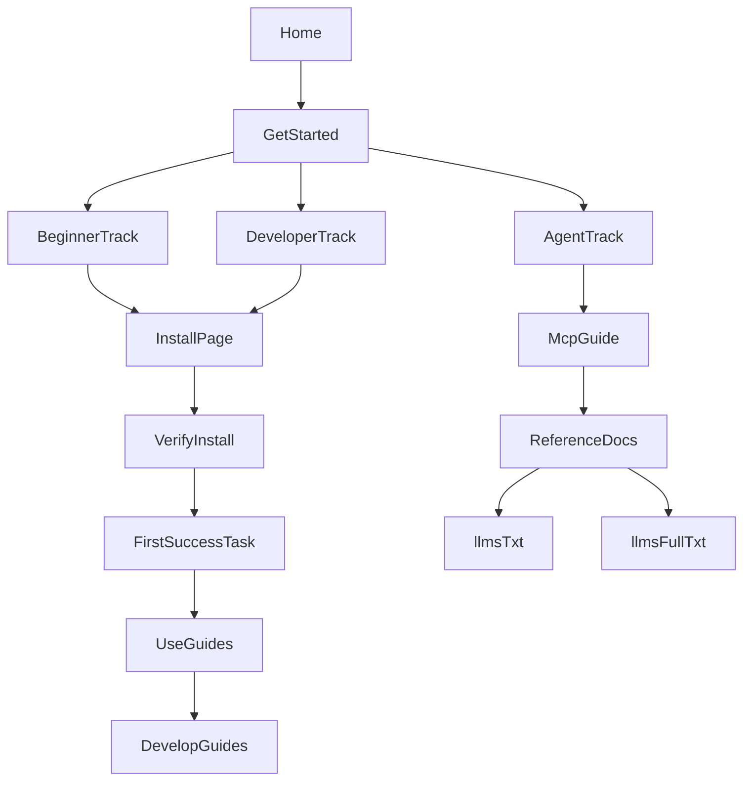

# IA and UX Strategy

This is the operating strategy for a docs-first website that serves both humans and AI agents.

## Product objective

- Make first success happen in under 5 minutes.
- Maximize install success and post-install task completion.
- Keep content easy to maintain through markdown-first authoring.
- Support all project types: libraries, applications, games, servers, protocols.

## Information architecture

Top-level navigation:

1. What is AE
2. Get Started
3. Install
4. Use
5. Develop
6. MCP
7. Troubleshooting
8. Reference

## Role-based onboarding

- Beginner: understand, install, verify.
- Developer: install, verify, execute one practical workflow.
- Agent: discover machine docs, execute deterministic command flow, recover by code.

## UX standards

- Every task page includes: prerequisites, command, expected result, recovery.
- One task per page to reduce cognitive and retrieval overhead.
- Search enabled locally for sub-100ms feel on typical docs sets.
- Navigation supports linear onboarding plus deep reference traversal.

## Flow diagram

